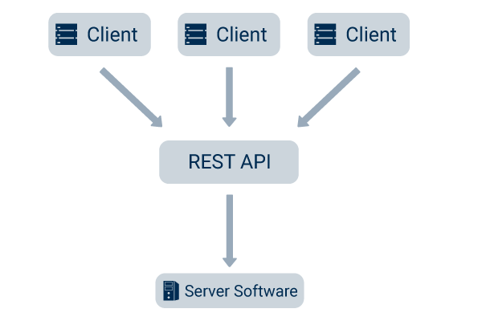

<div align="center" style="margin-bottom:30px;">
  
[](https://opensource.org/licenses/MIT) <a href="https://diogodeveloper.netlify.app" alt="Developer"> </a>




# WP REST API, a simple REST API for Wordpress.

</div>

## Technologies

This API was developed with **PHP 7.0**.

## Clone

```
$ git clone git@github.com:ArikBartzadok/WP-REST-API.git
# Recommend you to delete `.git`
$ cd <<PROJECT_NAME>> && rm -r .git
```

## Install

After downloading the theme (Api), move (or copy) it into the theme folder of your Wordpress installation, present at:

```
$ mv Api/ << PROJECT_FOLDER >>/wp-content/themes/
# Or copy
$ cp -r Api/ << PROJECT_FOLDER >>/wp-content/themes/
```

Finally, just activate the 'Api' theme on the Wordpress administration page, in "Side menu > Appearence".

And voilà, your REST API is active!

## Author

[Diogo Ferreira](https://diogodeveloper.netlify.app/)

## License

This project is open source and available under the [MIT License](LICENSE).

<div align="center" style="margin-bottom:30px">
  
# Support me

[](https://ko-fi.com/C0C81IJH6)

</div>